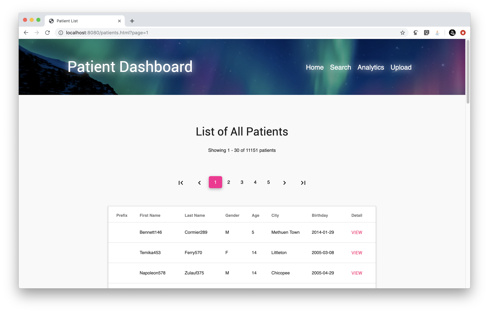
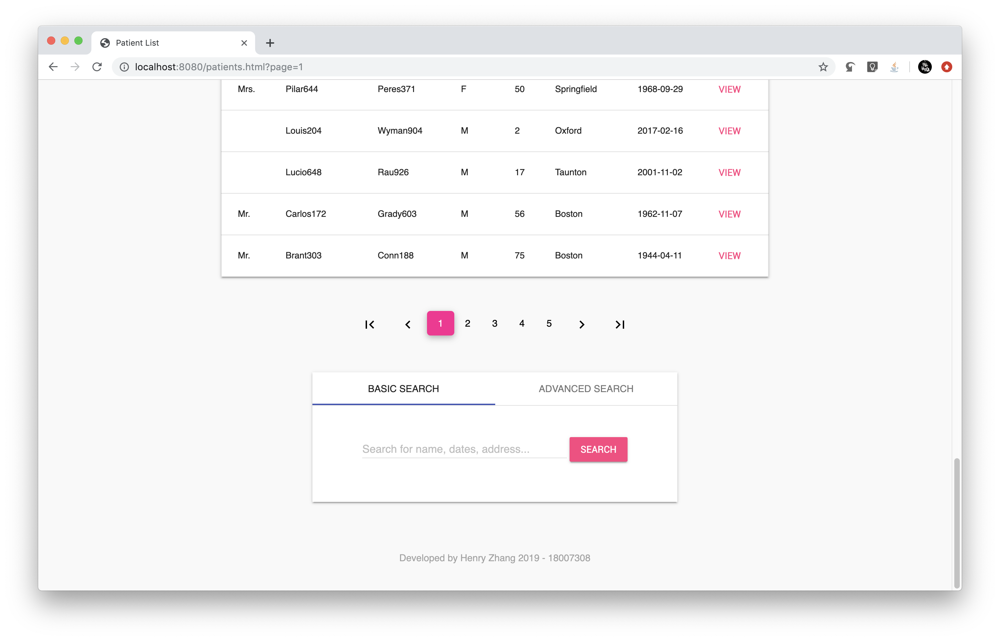
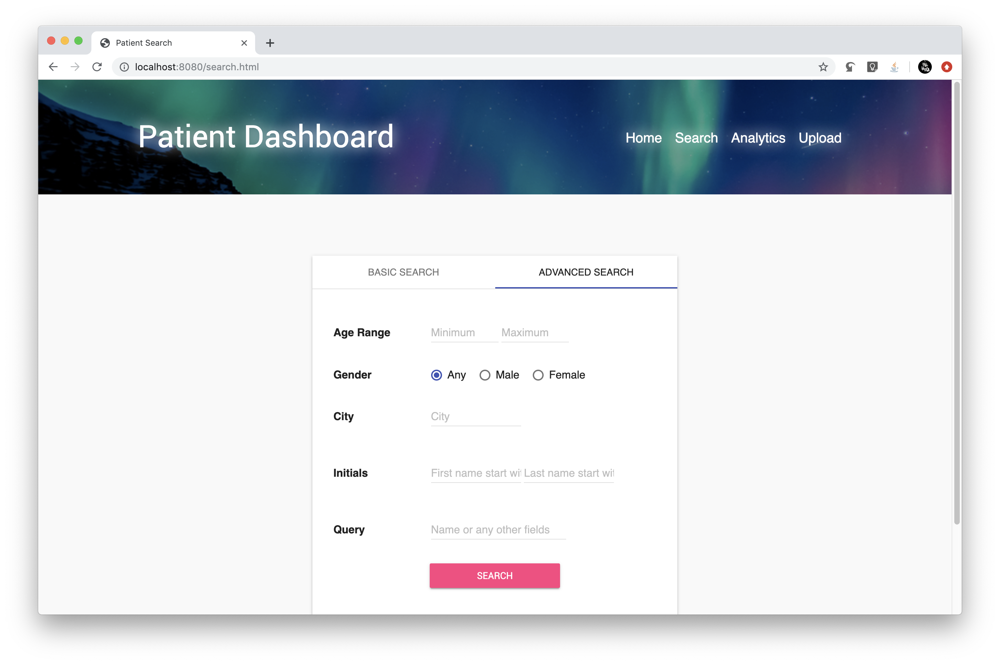
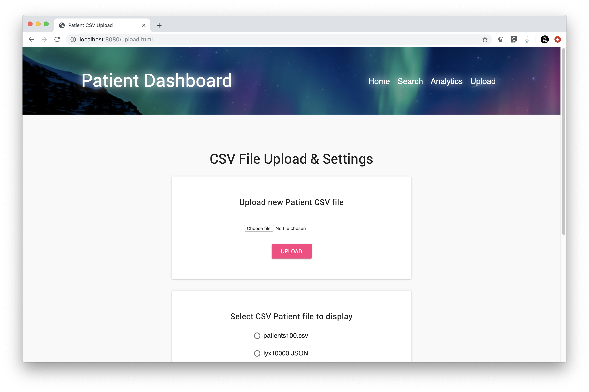
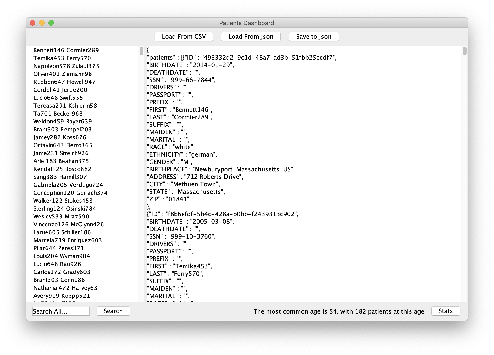
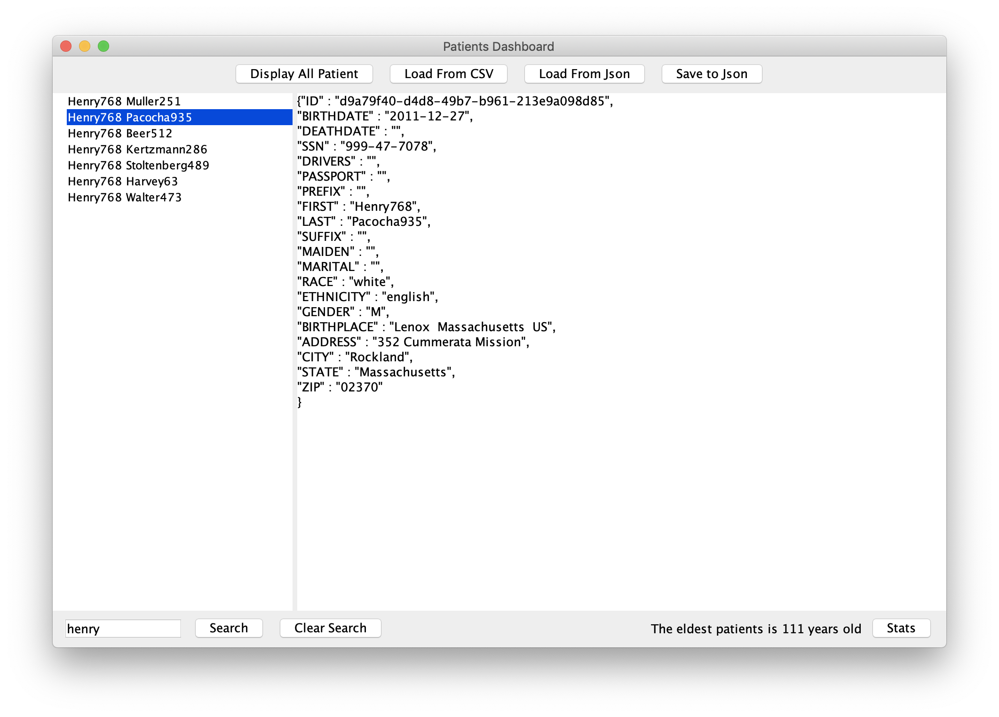
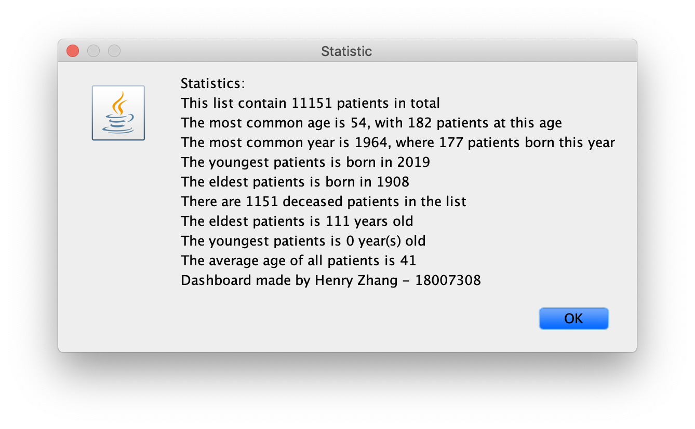

# NHS Java Coursework 2019
Ziheng Zhang
18007308

# Overview
This Coursework consists of a custom Bag data structure (part1), patient manager User Interface (part2), and patient dashboard Web Application (part3).

It is designed for clients like NHS, where a huge amount of patient data need to be imported (from JSON or CSV), displayed, searched and more.

# Screenshots

## Part 3 - Web Application

### Main Page

### Advanced Search

### Statistics

### Upload Additional File

## Part 2 - User Interface 

### Main UI

### Search

### Statistic

